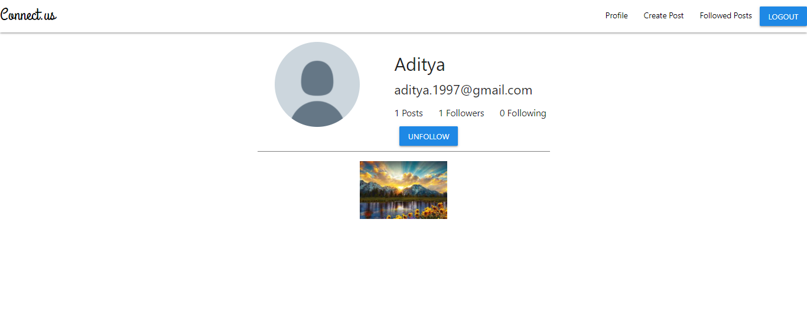

# Connect.us
Inspired from Instagram and LinkedIn

This is a MERN stack based project which mimics basic functionalities of Instagram/LinkedIn:
  - User Accounts
  - Auth System
  - Session Management
  - Profile Page
  - View Other's profile
  - Follow/Unfollow User (Followers and Following)
  - Posts Management
  - Create new Post
  - Like/Dislike Post
  - Comment on Posts
  - Delete Posts
  - Home page to See all Posts
  - See posts of Followed Users
  - Profile Pic Management
  - Success/Error Toast Messages
 
 # Dependencies : 
 1. Cloudinary API  :
    
    Required for Storage.
    
    Note : 
    - Update Cloudinary API URL in the Keys.js file on Client Side.
    - Update Default Picture URL from Cloundinary on Client Side.
    
 2. MongoDB Cloud: 
    
    Required for Data Management as Database.
    
    Node :
    - Update Username, Password and Database Name of MongoDB Cloud database in the Keys.js on Server Side.
    
 3. Bycrypt NPM Module :
 
    Required for Hashing Passwords.
 
 4. JSON Web Token (JWT) NPM Module :
 
    Required for Token generation and management for Authentication and Session Management.

 5. Materialize NPM Module :
 
    Required for CSS and Toast Messages.
 
 
# Screenshots :

Login Page : 

Sign up Page : 

Home Page : 

Profile Page :

Other's Profile View :

Posts from Followed Users :

Create Post Page :

